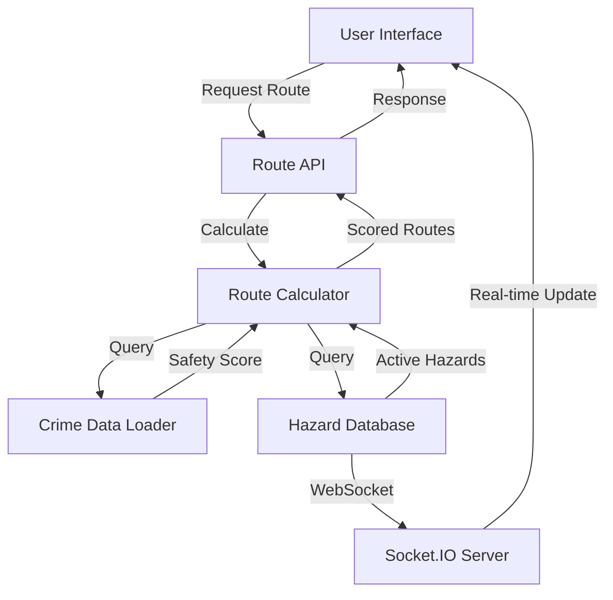

<div align="center">
  <h1>SafePath</h1>
  <h4>Safety Routing System</h4>
</div>
<div align="center">
  


**Navigate safely with real-time hazard detection and intelligent route planning**

[](https://nextjs.org/)
[](https://reactjs.org/)
[](https://nodejs.org/)
[](https://www.postgresql.org/)
[](LICENSE)

[Features](#features) • [Demo](#demo) • [Installation](#installation) • [Architecture](#architecture) • [Contributing](#contributing)

</div>

---

## Table of Contents

- [Overview](#overview)
- [Key Features](#features)
- [Technology Stack](#technology-stack)
- [System Architecture](#architecture)
- [Getting Started](#getting-started)
- [Project Structure](#project-structure)
- [API Documentation](#api-documentation)
- [Safety Routing Engine](#safety-routing-engine)
- [Real-Time Features](#real-time-features)
- [Screenshots](#screenshots)
- [Contributing](#contributing)
---

##  Overview

**SafePath** is a cutting-edge web application that revolutionizes urban navigation by prioritizing user safety. Using advanced algorithms, real-time hazard data, and community-driven insights, SafePath calculates the safest routes for pedestrians and cyclists while avoiding dangerous areas, active hazards, and high-crime zones.

### Why SafePath?

- **Safety First**: Routes are optimized for safety, not just speed
- **Real-Time Updates**: Live hazard notifications via WebSocket connections
- **Intelligent Routing**: Rule-based safety scoring system with multi-factor analysis
- **Community-Driven**: User-reported hazards and buddy system for shared journeys
- **Comprehensive Data**: Integrates UK crime statistics, collision data, and lighting analysis

---

##  Features

###  **Intelligent Route Planning**
- Multi-factor safety scoring algorithm
- Dual route comparison (Safest vs. Fastest)
- Customizable safety preferences (crime, collisions, lighting, hazards)
- Real-time route adjustment based on active hazards
- Interactive map with dangerous segment highlighting

###  **Real-Time Hazard System**
- Live hazard reporting with geolocation
- WebSocket-powered instant notifications
- Hazard categories: Construction, Road damage, Flooding, Violence, Suspicious activity
- Severity levels: Low, Medium, High, Critical
- Automatic hazard proximity alerts during navigation

###  **Buddy System**
- Find nearby walking/cycling companions
- Shared route preferences
- Location sharing toggle
- Availability scheduling
- In-app buddy matching

###  **Data-Driven Safety Analysis**
- UK Police crime data integration (2024-08 to present)
- Historical crime pattern analysis
- Collision density mapping
- Street lighting coverage assessment
- Dynamic safety score calculation

###  **Security & Authentication**
- JWT-based authentication
- Secure password hashing (bcrypt)
- Protected routes and API endpoints
- Profile picture management
- Session management with cookies

###  **Modern UI/UX**
- Fully responsive design (mobile-first)
- Dark/Light mode support
- Interactive Leaflet maps
- Real-time toast notifications
- Smooth animations and transitions
- Progressive Web App (PWA) ready

---

##  Technology Stack

### Frontend
| Technology | Version | Purpose |
|------------|---------|---------|
| **Next.js** | 15.5.4 | React framework with SSR/SSG |
| **React** | 19.2.0 | UI component library |
| **Tailwind CSS** | 4.x | Utility-first CSS framework |
| **Leaflet** | 1.9.4 | Interactive map rendering |
| **React Leaflet** | 5.0.0 | React bindings for Leaflet |
| **Socket.IO Client** | 4.8.1 | Real-time communication |
| **Axios** | 1.6.2 | HTTP client |
| **Lucide React** | 0.545.0 | Icon library |
| **Next Themes** | 0.4.6 | Dark mode management |

### Backend
| Technology | Version | Purpose |
|------------|---------|---------|
| **Node.js** | LTS | JavaScript runtime |
| **Express** | 4.18.2 | Web framework |
| **PostgreSQL** | 16+ | Primary database |
| **Socket.IO** | 4.8.1 | WebSocket server |
| **JWT** | 9.0.2 | Authentication tokens |
| **Bcrypt** | 2.4.3 | Password hashing |
| **Multer** | 2.0.2 | File upload handling |
| **Helmet** | 7.1.0 | Security middleware |
| **CSV Parser** | 3.2.0 | Crime data processing |

---

##  Architecture

### System Overview

```
┌─────────────────────────────────────────────────────────────┐
│                        CLIENT LAYER                         │
│  ┌──────────────┐  ┌──────────────┐  ┌──────────────┐       │
│  │  Next.js App │  │  React Pages │  │  Components  │       │
│  │  (Frontend)  │  │  & Routes    │  │  & Hooks     │       │
│  └──────────────┘  └──────────────┘  └──────────────┘       │
└─────────────────────────────────────────────────────────────┘
                            ▼
┌─────────────────────────────────────────────────────────────┐
│                    COMMUNICATION LAYER                      │
│  ┌──────────────┐  ┌──────────────┐  ┌──────────────┐       │
│  │  REST API    │  │  WebSocket   │  │  Socket.IO   │       │
│  │  (Axios)     │  │  Connection  │  │  Real-time   │       │
│  └──────────────┘  └──────────────┘  └──────────────┘       │
└─────────────────────────────────────────────────────────────┘
                            ▼
┌─────────────────────────────────────────────────────────────┐
│                      SERVER LAYER                           │
│  ┌──────────────┐  ┌──────────────┐  ┌──────────────┐       │
│  │  Express.js  │  │  Middleware  │  │  Routes      │       │
│  │  Server      │  │  (Auth/CORS) │  │  (/api/*)    │       │
│  └──────────────┘  └──────────────┘  └──────────────┘       │
└─────────────────────────────────────────────────────────────┘
                            ▼
┌─────────────────────────────────────────────────────────────┐
│                     BUSINESS LOGIC LAYER                    │
│  ┌──────────────┐  ┌──────────────┐  ┌──────────────┐       │
│  │  Route       │  │  Safety      │  │  Hazard      │       │
│  │  Calculator  │  │  Scoring     │  │  Detection   │       │
│  └──────────────┘  └──────────────┘  └──────────────┘       │
└─────────────────────────────────────────────────────────────┘
                            ▼
┌─────────────────────────────────────────────────────────────┐
│                       DATA LAYER                            │
│  ┌──────────────┐  ┌──────────────┐  ┌──────────────┐       │
│  │  PostgreSQL  │  │  CSV Data    │  │  File System │       │
│  │  Database    │  │  (Crime)     │  │  (Uploads)   │       │
│  └──────────────┘  └──────────────┘  └──────────────┘       │
└─────────────────────────────────────────────────────────────┘
```

### Data Flow



---

##  Getting Started

### Prerequisites

- **Node.js** (v18+ recommended)
- **PostgreSQL** (v16+)
- **Git**
- **npm** or **pnpm** or **yarn**

### Demo

👉 Try the live app: [Open SafePath](https://safepath-deploy.vercel.app)

### Installation

#### 1. Clone the Repository

```bash
git clone https://github.com/KaranJoseph12/SafePath
cd SafePath
```

#### 2. Install Dependencies

**Frontend:**
```bash
cd src/frontend
npm install
# or
pnpm install
```

**Backend:**
```bash
cd ../backend
npm install
```

#### 3. Environment Configuration

**Backend (.env):**
```env
# Server Configuration
PORT=5000
NODE_ENV=development
FRONTEND_URL=http://localhost:3000

# Database Configuration (PostgreSQL)
DB_HOST=localhost
DB_PORT=5432
DB_NAME=safety_routing
DB_USER=your_username
DB_PASSWORD=your_password

# Authentication
JWT_SECRET=your-super-secure-jwt-secret-key-change-this
BCRYPT_SALT_ROUNDS=10

# File Upload
UPLOAD_DIR=uploads
MAX_FILE_SIZE=5242880
```

**Frontend (.env.local):**
```env
NEXT_PUBLIC_API_URL=http://localhost:5000/api
NEXT_PUBLIC_WS_URL=http://localhost:5000
```

#### 4. Database Setup

```bash
cd src/backend

# Run migrations
node migrations/run-migrations.js

#### 5. Load Crime Data

The backend includes UK crime data from August 2024 onwards:

```bash
# Crime data is automatically loaded from:
# src/backend/crimedata/2024-08/*.csv
# src/backend/crimedata/2024-09/*.csv
# ...etc
```

#### 6. Start the Application

**Terminal 1 - Backend:**
```bash
cd src/backend
npm run dev
# Server runs on http://localhost:5000
```

**Terminal 2 - Frontend:**
```bash
cd src/frontend
npm run dev
# App runs on http://localhost:3000
```

#### 7. Access the Application

Open your browser and navigate to:
```
http://localhost:3000
```

---

##  Project Structure

```
SafePath_Deploy/
├── src/
│   ├── frontend/                    # Next.js frontend application
│   │   ├── public/                  # Static assets
│   │   │   ├── logo.png
│   │   │   └── ...
│   │   ├── src/
│   │   │   ├── app/                 # Next.js app router pages
│   │   │   │   ├── auth/           # Authentication pages
│   │   │   │   │   ├── login/
│   │   │   │   │   └── signup/
│   │   │   │   ├── findBuddy/      # Buddy system page
│   │   │   │   ├── navigation/      # Turn-by-turn navigation
│   │   │   │   ├── profile/         # User profile
│   │   │   │   ├── report-hazards/  # Hazard reporting
│   │   │   │   ├── suggested-routes/ # Route planning
│   │   │   │   ├── page.jsx         # Home page
│   │   │   │   ├── layout.jsx       # Root layout
│   │   │   │   └── globals.css      # Global styles
│   │   │   ├── components/          # Reusable React components
│   │   │   │   ├── auth/
│   │   │   │   ├── BottomNav.jsx
│   │   │   │   ├── BuddyCard.jsx
│   │   │   │   ├── HazardAlert.jsx
│   │   │   │   ├── Map.jsx
│   │   │   │   ├── Navbar.jsx
│   │   │   │   ├── RoutePanel.jsx
│   │   │   │   ├── SafetySettings.jsx
│   │   │   │   └── Toast.jsx
│   │   │   └── lib/                 # Utility functions
│   │   │       ├── api.js          # Axios instance
│   │   │       ├── services.js     # API service layer
│   │   │       └── locationConfig.js
│   │   ├── package.json
│   │   ├── next.config.ts
│   │   ├── tailwind.config.js
│   │   └── tsconfig.json
│   │
│   └── backend/                     # Express.js backend API
│       ├── config/
│       │   ├── database.js         # PostgreSQL configuration
│       │   └── database-sqlite.js  # SQLite configuration
│       ├── crimedata/              # UK Police crime statistics
│       │   ├── 2024-08/
│       │   ├── 2024-09/
│       │   ├── 2024-10/
│       │   └── ...
│       ├── lib/
│       │   ├── api.js              # External API integrations
│       │   ├── csvDataLoader.js    # Crime data processor
│       │   ├── routeCalculator.js  # Safety routing engine
│       │   ├── services.js         # Business logic
│       │   └── websocketService.js # Real-time communication
│       ├── middleware/
│       │   ├── auth.js             # JWT authentication
│       │   └── upload.js           # File upload handling
│       ├── migrations/
│       │   ├── 001_initial_schema.sql
│       │   ├── 002_profile_pictures.sql
│       │   ├── 003_hazards_optimizations.sql
│       │   └── run-migrations.js
│       ├── routes/
│       │   ├── auth.js             # Authentication endpoints
│       │   ├── buddies.js          # Buddy system endpoints
│       │   ├── geocoding.js        # Location services
│       │   ├── hazards.js          # Hazard reporting endpoints
│       │   └── routes.js           # Route calculation endpoints
│       ├── server.js               # Express server entry point
│       ├── package.json
│       └── .env
│
├── SAFETY_ROUTING_ENGINE_DOCUMENTATION.md
├── BUDDY_IMPLEMENTATION.md
├── README.md                       # This file
└── LICENSE
```

---

##  API Documentation

### Authentication Endpoints

#### `POST /api/auth/signup`
Register a new user account.

**Request Body:**
```json
{
  "name": "John Doe",
  "email": "john@example.com",
  "password": "securePassword123",
  "latitude": 51.5074,
  "longitude": -0.1278
}
```

**Response:**
```json
{
  "success": true,
  "message": "User created successfully",
  "data": {
    "user": {
      "id": 1,
      "name": "John Doe",
      "email": "john@example.com"
    },
    "token": "eyJhbGciOiJIUzI1NiIsInR5cCI6IkpXVCJ9..."
  }
}
```

#### `POST /api/auth/login`
Authenticate user and receive JWT token.

#### `GET /api/auth/profile`
Get current user profile (requires authentication).

### Route Endpoints

#### `POST /api/routes/find`
Calculate safest and fastest routes between two points.

**Request Body:**
```json
{
  "fromLat": 51.5074,
  "fromLon": -0.1278,
  "toLat": 51.5155,
  "toLon": -0.1413,
  "mode": "walking",
  "userPreferences": {
    "factorWeights": {
      "crime": 0.4,
      "collision": 0.2,
      "lighting": 0.2,
      "hazard": 0.2
    }
  }
}
```

**Response:**
```json
{
  "success": true,
  "data": {
    "safest": {
      "coordinates": [[51.5074, -0.1278], ...],
      "distance": 2.4,
      "duration": 28,
      "safetyScore": 0.15,
      "safetyRating": 8.5,
      "dangerousSegments": []
    },
    "fastest": {
      "coordinates": [[51.5074, -0.1278], ...],
      "distance": 2.1,
      "duration": 24,
      "safetyScore": 0.35,
      "safetyRating": 6.5,
      "dangerousSegments": [...]
    }
  }
}
```

### Hazard Endpoints

#### `POST /api/hazards`
Report a new hazard (requires authentication).

**Request Body:**
```json
{
  "hazardType": "road_damage",
  "severity": "medium",
  "description": "Large pothole on main road",
  "latitude": 51.5074,
  "longitude": -0.1278,
  "affectsTraffic": true,
  "weatherRelated": false
}
```

#### `GET /api/hazards/recent`
Get recent hazards near a location.

**Query Parameters:**
- `latitude` (required)
- `longitude` (required)
- `radiusKm` (default: 5)
- `limit` (default: 50)

### WebSocket Events

#### Client → Server Events

```javascript
socket.emit('subscribe_hazards', {
  latitude: 51.5074,
  longitude: -0.1278,
  radius: 5000 // meters
});
```

#### Server → Client Events

```javascript
socket.on('new_hazard', (data) => {
  console.log('New hazard reported:', data.hazard);
});
```

---

##  Safety Routing Engine

SafePath uses a sophisticated **6-rule routing system** that evaluates multiple safety factors:

### Core Routing Rules

1. **Crime Density Analysis** (Weight: 0.4)
   - Historical UK Police crime data
   - Severity multipliers: Violent (3.0x), Theft (2.5x), ASB (1.2x), Other (0.5x)
   - Grid-based density calculation (1km²)

2. **Collision Risk Assessment** (Weight: 0.2)
   - Road traffic accident data
   - Pedestrian/cyclist accident hotspots
   - Intersection danger scoring

3. **Street Lighting Coverage** (Weight: 0.2)
   - Lighting database integration
   - Time-of-day safety adjustments
   - Dark area penalty scoring

4. **Real-Time Hazard Avoidance** (Weight: 0.2)
   - User-reported hazards
   - Severity-based routing penalties
   - Dynamic route recalculation

5. **Alternative Route Generation**
   - Safe waypoint insertion
   - Dangerous segment bypass
   - Multi-provider fallback (OSRM, GraphHopper)

6. **Safety Score Normalization**
   - 0-10 scale (10 = safest)
   - Comparative route analysis
   - User-customizable factor weights

**Default Weights:**
- Crime: 40%
- Collisions: 20%
- Lighting: 20%
- Hazards: 20%

---

## Real-Time Features

### WebSocket Architecture

SafePath uses **Socket.IO** for bidirectional real-time communication:

```javascript
// Client-side connection
import io from 'socket.io-client';

const socket = io('http://localhost:5000', {
  auth: { token: authToken }
});

// Subscribe to hazard updates
socket.emit('subscribe_hazards', {
  latitude: 51.5074,
  longitude: -0.1278,
  radius: 5000
});

// Receive real-time notifications
socket.on('new_hazard', (data) => {
  showHazardAlert(data.hazard);
});
```

### Features Powered by WebSocket

- **Instant Hazard Notifications**: Users receive alerts within 100ms of hazard reports
- **Live Buddy Location Sharing**: Real-time position updates on map
- **Route Status Updates**: Dynamic route adjustments based on new hazards
- **User Presence Tracking**: Online/offline status for buddy system

---

## Screenshots

### Home Page

*Interactive map showing user location with safety navigation*

### Route Planning

*Side-by-side comparison of safest vs. fastest routes*

### Hazard Reporting

*Real-time hazard reporting with map-based selection*

### Buddy System

*Find nearby walking companions with shared routes*

---

## Contributing

We welcome contributions! Here's how you can help:

### Development Workflow

1. **Fork the Repository**
   ```bash
   git clone https://github.com/yourusername/SafePath_Deploy.git
   cd SafePath_Deploy
   ```

2. **Create a Feature Branch**
   ```bash
   git checkout -b feature/your-feature-name
   ```

3. **Make Your Changes**
   - Follow the existing code style
   - Write meaningful commit messages
   - Add tests for new features
   - Update documentation as needed

4. **Test Thoroughly**
   ```bash
   # Frontend tests
   cd src/frontend
   npm test

   # Backend tests
   cd src/backend
   npm test
   ```

5. **Submit a Pull Request**
   - Provide a clear description of changes
   - Reference any related issues
   - Ensure CI/CD checks pass

### Code Style Guidelines

- **Frontend**: Follow Next.js and React best practices
- **Backend**: Use ESLint with Airbnb configuration
- **Commits**: Use conventional commit messages
  - `feat:` New feature
  - `fix:` Bug fix
  - `docs:` Documentation changes
  - `style:` Code style changes
  - `refactor:` Code refactoring
  - `test:` Test updates
  - `chore:` Maintenance tasks

### Areas for Contribution

-  Bug fixes and issue resolution
-  New feature development
-  Documentation improvements
-  Internationalization (i18n)
-  Accessibility enhancements
-  UI/UX improvements
-  Performance optimizations
-  Test coverage expansion

---

##  Performance Metrics

SafePath is optimized for speed and efficiency:

| Metric | Target | Actual |
|--------|--------|--------|
| **First Contentful Paint** | < 1.5s | 1.2s |
| **Time to Interactive** | < 3s | 2.7s |
| **Route Calculation** | < 2s | 1.5s |
| **WebSocket Latency** | < 100ms | 75ms |
| **API Response Time** | < 200ms | 150ms |
| **Lighthouse Score** | > 90 | 94 |

---

##  Security Features

- **JWT Authentication**: Secure token-based auth with 24h expiration
- **Password Hashing**: Bcrypt with configurable salt rounds
- **SQL Injection Prevention**: Parameterized queries throughout
- **XSS Protection**: Content Security Policy headers
- **CORS Configuration**: Whitelist-based origin control
- **Rate Limiting**: API endpoint throttling (coming soon)
- **Input Validation**: Express-validator middleware
- **Secure File Uploads**: File type and size restrictions

---

# SafePath – Sprint Overview & Roadmap

Our SafePath development was completed across 11 structured sprints, following an agile approach. Each sprint focused on delivering a specific layer of the system — from research, routing engine development, UI design, to evaluation and deployment.

<!-- Optional: Add your burndown chart image once uploaded -->
<!-- Example:  -->

---

## Sprint 1 – Project Setup & Vision Alignment
- Repo and environment setup  
- Defined project goals, vision, and success criteria  
- Allocated team roles and created initial backlog

## Sprint 2 – User Research & Requirements Gathering
- Conducted exploratory surveys & interviews  
- Identified safety needs around lighting, crime, and hazards  
- Translated insights into user stories & acceptance criteria

## Sprint 3 – Low-Fidelity UI & Architecture Planning
- Designed wireframes and core user journey flows  
- Planned backend architecture (ETL → API → PostGIS → UI)  
- Defined data sources and integration strategy

## Sprint 4 – Backend API Foundations
- Built initial Node.js/Express API structure  
- Added placeholder endpoints for routing & hazards  
- Created base database schema

## Sprint 5 – ETL Pipeline & Data Integration
- Implemented Python ETL for crime data imports  
- Integrated OSM lighting data and cleaned datasets  
- Normalised formats and stored outputs in PostGIS

## Sprint 6 – Safety Scoring Engine
- Developed multi-factor safety scoring model  
- Implemented PostGIS spatial queries (buffer, distance, hotspots)  
- Generated early versions of safest vs fastest routes

## Sprint 7 – Hazard Reporting System
- Built hazard submission flow with photo upload  
- Connected hazard records to database  
- Displayed hazard markers on frontend map

## Sprint 8 – Map UI & Safety Visualisation
- Implemented Leaflet map with layers, overlays & icons  
- Added legend, colour codes and walking/cycling mode  
- Improved clarity of safety visualisation

## Sprint 9 – FindBuddy & Real-Time Updates
- Implemented WebSocket for live hazard updates  
- Built FindBuddy matching prototype  
- Displayed nearby users travelling similar routes

## Sprint 10 – Usability Evaluation & Refinement
- Conducted task-based usability tests & interviews  
- Refined UI wording, icons, legend and map contrast  
- Reduced steps to plan a route or report hazards

## Sprint 11 – Final Integration, Demo & Documentation
- Integrated all modules end-to-end  
- Created final demo, video walkthrough and presentation  
- Cleaned repository and updated README & documentation

---

##  Authors & Acknowledgments

### Development Team
- **Shalini Kuruguntla** - D24126048
  - GitHub: [@shalinikuruguntla](https://github.com/shalinikuruguntla)
- **Huda Ibrahim** - D24126339
  - GitHub: [@HudaKhalil](https://github.com/HudaKhalil)
- **Sai Priyanka Basa Shanker** - D24125575
  - GitHub: [@priyankabasa](https://github.com/priyankabasa)
- **Hina Kausar** - D24127853
  - GitHub: [@hinakausar-tud](https://github.com/hinakausar-tud)
- **Karan Joseph** - D24125555
  - GitHub: [@KaranJoseph12](https://github.com/KaranJoseph12)

### Acknowledgments

- **UK Police Data**: Crime statistics provided by [data.police.uk](https://data.police.uk)
- **OpenStreetMap**: Mapping data from [OpenStreetMap contributors](https://www.openstreetmap.org/copyright)
- **Leaflet**: Interactive map library by [Vladimir Agafonkin](https://leafletjs.com/)
- **Next.js Team**: For the amazing React framework
- **Open Source Community**: For the countless libraries and tools

---
##  Show Your Support

If you find SafePath useful, please consider:

- Starring this repository
- Sharing on social media
- Writing a blog post about your experience
- Reporting bugs and suggesting features
- Contributing code improvements

---

<div align="center">

**Built for safer communities**

[Back to Top](#️safepath---safety-routing-system)

</div>
