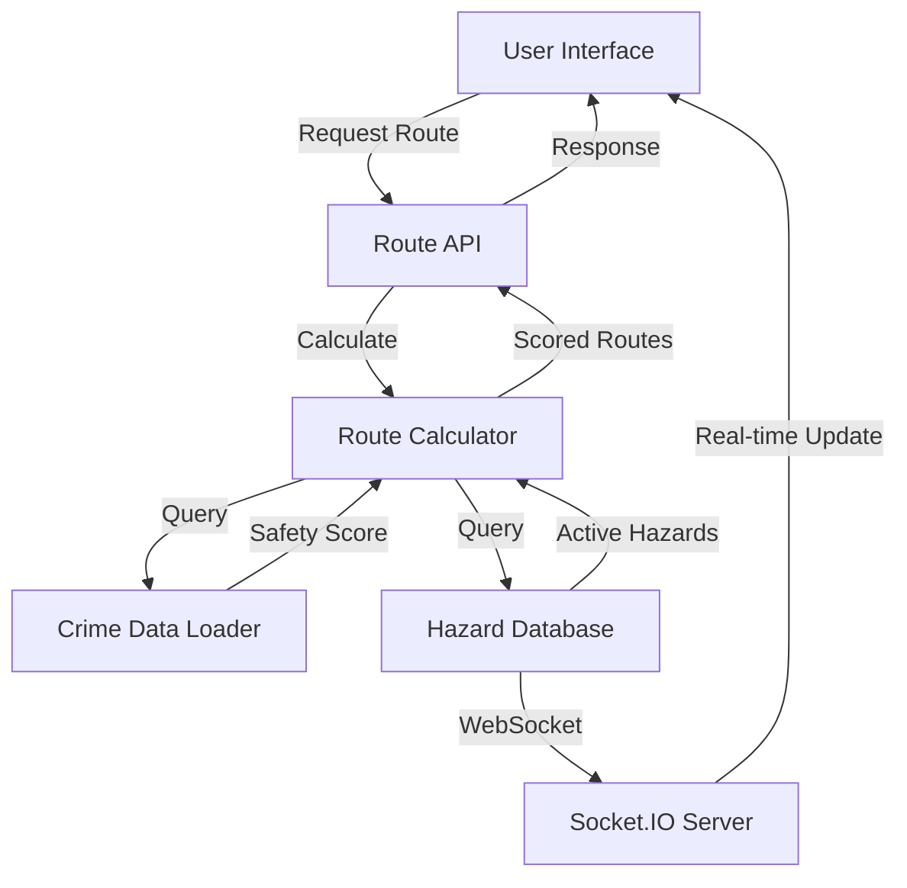

<div align="center">
  <h1>SafePath</h1>
  <h4>Safety Routing System</h4>
</div>
<div align="center">
  


**Navigate safely with real-time hazard detection and intelligent route planning**

[](https://nextjs.org/)
[](https://reactjs.org/)
[](https://nodejs.org/)
[](https://www.postgresql.org/)
[](LICENSE)

[Features](#-features) • [Demo](#-demo) • [Installation](#-installation) • [Architecture](#-architecture) • [Contributing](#-contributing)

</div>

---

## Table of Contents

- [Overview](#overview)
- [Key Features](#features)
- [Technology Stack](#technology-stack)
- [System Architecture](#architecture)
- [Getting Started](#getting-started)
- [Project Structure](#project-structure)
- [API Documentation](#api-documentation)
- [Safety Routing Engine](#safety-routing-engine)
- [Real-Time Features](#real-time-features)
- [Screenshots](#screenshots)
- [Contributing](#contributing)
---

##  Overview

**SafePath** is a cutting-edge web application that revolutionizes urban navigation by prioritizing user safety. Using advanced algorithms, real-time hazard data, and community-driven insights, SafePath calculates the safest routes for pedestrians and cyclists while avoiding dangerous areas, active hazards, and high-crime zones.

### Why SafePath?

- **Safety First**: Routes are optimized for safety, not just speed
- **Real-Time Updates**: Live hazard notifications via WebSocket connections
- **Intelligent Routing**: Rule-based safety scoring system with multi-factor analysis
- **Community-Driven**: User-reported hazards and buddy system for shared journeys
- **Comprehensive Data**: Integrates UK crime statistics, collision data, and lighting analysis

---

##  Features

###  **Intelligent Route Planning**
- Multi-factor safety scoring algorithm
- Dual route comparison (Safest vs. Fastest)
- Customizable safety preferences (crime, collisions, lighting, hazards)
- Real-time route adjustment based on active hazards
- Interactive map with dangerous segment highlighting

###  **Real-Time Hazard System**
- Live hazard reporting with geolocation
- WebSocket-powered instant notifications
- Hazard categories: Construction, Road damage, Flooding, Violence, Suspicious activity
- Severity levels: Low, Medium, High, Critical
- Automatic hazard proximity alerts during navigation

###  **Buddy System**
- Find nearby walking/cycling companions
- Shared route preferences
- Location sharing toggle
- Availability scheduling
- In-app buddy matching

###  **Data-Driven Safety Analysis**
- UK Police crime data integration (2024-08 to present)
- Historical crime pattern analysis
- Collision density mapping
- Street lighting coverage assessment
- Dynamic safety score calculation

###  **Security & Authentication**
- JWT-based authentication
- Secure password hashing (bcrypt)
- Protected routes and API endpoints
- Profile picture management
- Session management with cookies

###  **Modern UI/UX**
- Fully responsive design (mobile-first)
- Dark/Light mode support
- Interactive Leaflet maps
- Real-time toast notifications
- Smooth animations and transitions
- Progressive Web App (PWA) ready

---

##  Technology Stack

### Frontend
| Technology | Version | Purpose |
|------------|---------|---------|
| **Next.js** | 15.5.4 | React framework with SSR/SSG |
| **React** | 19.2.0 | UI component library |
| **Tailwind CSS** | 4.x | Utility-first CSS framework |
| **Leaflet** | 1.9.4 | Interactive map rendering |
| **React Leaflet** | 5.0.0 | React bindings for Leaflet |
| **Socket.IO Client** | 4.8.1 | Real-time communication |
| **Axios** | 1.6.2 | HTTP client |
| **Lucide React** | 0.545.0 | Icon library |
| **Next Themes** | 0.4.6 | Dark mode management |

### Backend
| Technology | Version | Purpose |
|------------|---------|---------|
| **Node.js** | LTS | JavaScript runtime |
| **Express** | 4.18.2 | Web framework |
| **PostgreSQL** | 16+ | Primary database |
| **Socket.IO** | 4.8.1 | WebSocket server |
| **JWT** | 9.0.2 | Authentication tokens |
| **Bcrypt** | 2.4.3 | Password hashing |
| **Multer** | 2.0.2 | File upload handling |
| **Helmet** | 7.1.0 | Security middleware |
| **CSV Parser** | 3.2.0 | Crime data processing |

---

##  Architecture

### System Overview

```
┌─────────────────────────────────────────────────────────────┐
│                        CLIENT LAYER                         │
│  ┌──────────────┐  ┌──────────────┐  ┌──────────────┐       │
│  │  Next.js App │  │  React Pages │  │  Components  │       │
│  │  (Frontend)  │  │  & Routes    │  │  & Hooks     │       │
│  └──────────────┘  └──────────────┘  └──────────────┘       │
└─────────────────────────────────────────────────────────────┘
                            ▼
┌─────────────────────────────────────────────────────────────┐
│                    COMMUNICATION LAYER                      │
│  ┌──────────────┐  ┌──────────────┐  ┌──────────────┐       │
│  │  REST API    │  │  WebSocket   │  │  Socket.IO   │       │
│  │  (Axios)     │  │  Connection  │  │  Real-time   │       │
│  └──────────────┘  └──────────────┘  └──────────────┘       │
└─────────────────────────────────────────────────────────────┘
                            ▼
┌─────────────────────────────────────────────────────────────┐
│                      SERVER LAYER                           │
│  ┌──────────────┐  ┌──────────────┐  ┌──────────────┐       │
│  │  Express.js  │  │  Middleware  │  │  Routes      │       │
│  │  Server      │  │  (Auth/CORS) │  │  (/api/*)    │       │
│  └──────────────┘  └──────────────┘  └──────────────┘       │
└─────────────────────────────────────────────────────────────┘
                            ▼
┌─────────────────────────────────────────────────────────────┐
│                     BUSINESS LOGIC LAYER                    │
│  ┌──────────────┐  ┌──────────────┐  ┌──────────────┐       │
│  │  Route       │  │  Safety      │  │  Hazard      │       │
│  │  Calculator  │  │  Scoring     │  │  Detection   │       │
│  └──────────────┘  └──────────────┘  └──────────────┘       │
└─────────────────────────────────────────────────────────────┘
                            ▼
┌─────────────────────────────────────────────────────────────┐
│                       DATA LAYER                            │
│  ┌──────────────┐  ┌──────────────┐  ┌──────────────┐       │
│  │  PostgreSQL  │  │  CSV Data    │  │  File System │       │
│  │  Database    │  │  (Crime)     │  │  (Uploads)   │       │
│  └──────────────┘  └──────────────┘  └──────────────┘       │
└─────────────────────────────────────────────────────────────┘
```

### Data Flow



---

##  Getting Started

### Prerequisites

- **Node.js** (v18+ recommended)
- **PostgreSQL** (v16+)
- **Git**
- **npm** or **pnpm** or **yarn**

### Installation

#### 1. Clone the Repository

```bash
git clone https://github.com/KaranJoseph12/SafePath
cd SafePath
```

#### 2. Install Dependencies

**Frontend:**
```bash
cd src/frontend
npm install
# or
pnpm install
```

**Backend:**
```bash
cd ../backend
npm install
```

#### 3. Environment Configuration

**Backend (.env):**
```env
# Server Configuration
PORT=5000
NODE_ENV=development
FRONTEND_URL=http://localhost:3000

# Database Configuration (PostgreSQL)
DB_HOST=localhost
DB_PORT=5432
DB_NAME=safety_routing
DB_USER=your_username
DB_PASSWORD=your_password

# Authentication
JWT_SECRET=your-super-secure-jwt-secret-key-change-this
BCRYPT_SALT_ROUNDS=10

# File Upload
UPLOAD_DIR=uploads
MAX_FILE_SIZE=5242880
```

**Frontend (.env.local):**
```env
NEXT_PUBLIC_API_URL=http://localhost:5000/api
NEXT_PUBLIC_WS_URL=http://localhost:5000
```

#### 4. Database Setup

```bash
cd src/backend

# Run migrations
node migrations/run-migrations.js

#### 5. Load Crime Data

The backend includes UK crime data from August 2024 onwards:

```bash
# Crime data is automatically loaded from:
# src/backend/crimedata/2024-08/*.csv
# src/backend/crimedata/2024-09/*.csv
# ...etc
```

#### 6. Start the Application

**Terminal 1 - Backend:**
```bash
cd src/backend
npm run dev
# Server runs on http://localhost:5000
```

**Terminal 2 - Frontend:**
```bash
cd src/frontend
npm run dev
# App runs on http://localhost:3000
```

#### 7. Access the Application

Open your browser and navigate to:
```
http://localhost:3000
```

---

##  Project Structure

```
SafePath_Deploy/
├── src/
│   ├── frontend/                    # Next.js frontend application
│   │   ├── public/                  # Static assets
│   │   │   ├── logo.png
│   │   │   └── ...
│   │   ├── src/
│   │   │   ├── app/                 # Next.js app router pages
│   │   │   │   ├── auth/           # Authentication pages
│   │   │   │   │   ├── login/
│   │   │   │   │   └── signup/
│   │   │   │   ├── findBuddy/      # Buddy system page
│   │   │   │   ├── navigation/      # Turn-by-turn navigation
│   │   │   │   ├── profile/         # User profile
│   │   │   │   ├── report-hazards/  # Hazard reporting
│   │   │   │   ├── suggested-routes/ # Route planning
│   │   │   │   ├── page.jsx         # Home page
│   │   │   │   ├── layout.jsx       # Root layout
│   │   │   │   └── globals.css      # Global styles
│   │   │   ├── components/          # Reusable React components
│   │   │   │   ├── auth/
│   │   │   │   ├── BottomNav.jsx
│   │   │   │   ├── BuddyCard.jsx
│   │   │   │   ├── HazardAlert.jsx
│   │   │   │   ├── Map.jsx
│   │   │   │   ├── Navbar.jsx
│   │   │   │   ├── RoutePanel.jsx
│   │   │   │   ├── SafetySettings.jsx
│   │   │   │   └── Toast.jsx
│   │   │   └── lib/                 # Utility functions
│   │   │       ├── api.js          # Axios instance
│   │   │       ├── services.js     # API service layer
│   │   │       └── locationConfig.js
│   │   ├── package.json
│   │   ├── next.config.ts
│   │   ├── tailwind.config.js
│   │   └── tsconfig.json
│   │
│   └── backend/                     # Express.js backend API
│       ├── config/
│       │   ├── database.js         # PostgreSQL configuration
│       │   └── database-sqlite.js  # SQLite configuration
│       ├── crimedata/              # UK Police crime statistics
│       │   ├── 2024-08/
│       │   ├── 2024-09/
│       │   ├── 2024-10/
│       │   └── ...
│       ├── lib/
│       │   ├── api.js              # External API integrations
│       │   ├── csvDataLoader.js    # Crime data processor
│       │   ├── routeCalculator.js  # Safety routing engine
│       │   ├── services.js         # Business logic
│       │   └── websocketService.js # Real-time communication
│       ├── middleware/
│       │   ├── auth.js             # JWT authentication
│       │   └── upload.js           # File upload handling
│       ├── migrations/
│       │   ├── 001_initial_schema.sql
│       │   ├── 002_profile_pictures.sql
│       │   ├── 003_hazards_optimizations.sql
│       │   └── run-migrations.js
│       ├── routes/
│       │   ├── auth.js             # Authentication endpoints
│       │   ├── buddies.js          # Buddy system endpoints
│       │   ├── geocoding.js        # Location services
│       │   ├── hazards.js          # Hazard reporting endpoints
│       │   └── routes.js           # Route calculation endpoints
│       ├── uploads/                # User-uploaded files
│       │   ├── hazards/
│       │   └── profiles/
│       ├── server.js               # Express server entry point
│       ├── package.json
│       └── .env
│
├── SAFETY_ROUTING_ENGINE_DOCUMENTATION.md
├── BUDDY_IMPLEMENTATION.md
├── README.md                       # This file
└── LICENSE
```

---
